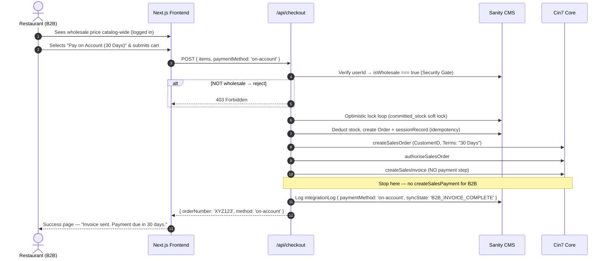

# B2B "Pay on Account" — Finalized Implementation Plan

Provide a seamless B2B experience for approved restaurants and hospitality buyers to place bulk
orders on **30-day credit terms**, bypassing Stripe entirely and pushing a formal tax invoice
directly into Cin7 Core.

**Decisions locked in:**
- Payment Terms: `"30 Days"` (restaurant has 30 calendar days to pay via bank transfer)
- Pricing visibility: **Catalog-wide** — verified wholesale accounts see their discounted prices across the Cellar shop and product pages, not just in the cart.

---

## Architecture Overview



---

## Resolved Open Questions

| Question | Decision |
|---|---|
| Payment Terms | `"30 Days"` — hardcoded as the B2B default |
| Pricing Visibility | **Catalog-wide** — wholesale users see discounted prices on the Cellar page and product detail pages |

---

## Critical Gaps Patched (from analysis)

### 🔴 Gap 1 — Janitor Cron will corrupt accounting for B2B orders
**Problem:** The Janitor Cron state machine always ends by calling `createSalesPayment`. For a
`"30 Days"` credit order, this would incorrectly post a cash payment against an unpaid
credit invoice in Cin7/Xero.

**Fix:** Add `paymentMethod` to `integrationLogType.ts`. The Janitor Cron checks this field:
- If `paymentMethod === 'on-account'` → stop at `INVOICE_AUTHORISED`, mark `status: 'success'`, skip `createSalesPayment`.
- Add a new terminal sync state: `B2B_INVOICE_COMPLETE` to clearly distinguish these orders.

---

### 🔴 Gap 2 — No idempotency key for non-Stripe orders
**Problem:** Every existing idempotency check uses `stripe_session_id`. B2B orders have no Stripe
session, so a Vercel timeout mid-request would leave the system unable to detect duplicates,
risking double-submission to Cin7.

**Fix:** The `/api/checkout` B2B path generates a deterministic reference ID server-side:
```
b2b-${clerkUserId}-${Date.now()}
```
This ID is used as:
1. The `sessionRecord._id` in Sanity (idempotency document, same as Stripe flow)
2. The `CustomerReference` in the Cin7 `Cin7SalePayload` (correlation key in ERP)
3. The `stripeSessionId` field in the `integrationLog` (reusing the field, value is the b2b ref)

---

### 🟡 Gap 3 — No rollback if Cin7 fails after stock is locked
**Problem:** The plan locked stock in Sanity then called Cin7, but if Cin7 was unreachable the
`committed_stock` would stay locked permanently with no webhook to clean it up.

**Fix:** Wrap the entire Cin7 call block in a `try/catch`. On failure:
1. Explicitly decrement `committed_stock` back to its original value (mirror of the existing
   Stripe error rollback at lines 152–161 of the current checkout route).
2. Mark the `integrationLog` as `status: 'failed'` so the Janitor Cron picks it up.
3. Return a user-friendly 503 to the frontend.

---

## Proposed Changes

### 1. CMS Schema Modifications

#### [MODIFY] src/sanity/schemaTypes/userType.ts
Add three new fields to the `customer` document:

| Field | Type | Details |
|---|---|---|
| `isWholesale` | `boolean` | Default `false`. Admin toggles this to `true` to approve a restaurant account. |
| `cin7CustomerId` | `string` | The Cin7 GUID for their customer profile in DEAR. Used as `CustomerID` in sale payloads. Falls back to `CIN7_DEFAULT_CUSTOMER_ID` env var if blank. |
| `billingTerms` | `string` | Default `"30 Days"`. Admin-editable so individual accounts can have custom terms if needed. |

---

#### [MODIFY] src/sanity/schemaTypes/wineType.ts
Add one new field to the `wine` document:

| Field | Type | Details |
|---|---|---|
| `wholesalePrice` | `number` (cents) | The B2B price per bottle in cents. If blank, falls back to the retail `price`. |

---

#### [MODIFY] src/sanity/schemaTypes/orderType.ts
Add two new fields to differentiate payment methods and preserve a transaction snapshot:

| Field | Type | Details |
|---|---|---|
| `paymentMethod` | `string` (options: `stripe`, `on-account`) | How this order was paid. |
| `billingTerms` | `string` | Snapshot of the terms at time of order (e.g., `"30 Days"`). |

Also add `'Awaiting Payment (30 Days)'` to the `status` field option list, as the initial
status for B2B orders (replacing `'Processing'` which implies a Stripe payment was received).

---

#### [MODIFY] src/sanity/schemaTypes/integrationLogType.ts
Two additions to support Gap 1 and Gap 2 fixes:

1. Add `paymentMethod` field (`string`, `stripe` | `on-account`) — so the Janitor knows whether to attempt Step 4 (payment creation).
2. Add `B2B_INVOICE_COMPLETE` to the `syncState` option list as a valid terminal state.

---

### 2. Backend Logic

#### [MODIFY] src/app/api/checkout/route.ts
Split into two clean code paths based on `paymentMethod` from the request body:

**B2B Path (`paymentMethod === 'on-account'`):**
1. Parse `paymentMethod` from request body alongside `items`.
2. **Security Gate:** Fetch `*[_type == "customer" && clerkId == $userId][0]{ isWholesale, cin7CustomerId, billingTerms }` from Sanity. If `isWholesale !== true`, return 403 immediately.
3. Generate `b2bRef = "b2b-" + userId + "-" + Date.now()` as the idempotency/correlation key.
4. Run the same optimistic-locking retry loop (fetch `_rev`, check stock, patch `committed_stock`).
   - Use `wholesalePrice ?? price` from Sanity as the authoritative unit price.
5. After stock lock succeeds, atomically:
   - Create `sessionRecord` with `_id: b2bRef` (idempotency guard).
   - Create `order` document with `paymentMethod: 'on-account'`, `billingTerms: "30 Days"`, `status: "Awaiting Payment (30 Days)"`.
   - Deduct `committed_stock` + increment `sold_count`.
6. **Cin7 block (with rollback on failure):**
   ```
   try:
     createSalesOrder({ CustomerID, Terms: "30 Days", CustomerReference: b2bRef, ... })
     authoriseSalesOrder(saleId, lines)
     createSalesInvoice(saleId, lines)
     // NO createSalesPayment — stop here for B2B
     Logger.createTransactionLog({ paymentMethod: 'on-account', syncState: 'B2B_INVOICE_COMPLETE', status: 'success' })
   catch:
     // ROLLBACK: decrement committed_stock back
     revertTx.patch(itemId, p => p.dec({ committed_stock: qty }))
     Logger.createTransactionLog({ paymentMethod: 'on-account', status: 'failed', errorMessage })
     return 503
   ```
7. On success, return `{ orderNumber, method: 'on-account' }` — no Stripe URL.

**Retail Stripe Path (existing, minor enhancement):**
- After fetching `winesInDb`, resolve the authoritative price:
  ```ts
  price: isWholesale ? (dbWine.wholesalePrice ?? dbWine.price) : dbWine.price
  ```
- Everything else stays the same.

---

#### [MODIFY] src/app/api/cron/cin7-retry/route.ts
Patch the state machine to be B2B-aware:

```ts
// Step 4 — Create Payment (SKIP for B2B on-account orders)
if (log.syncState === 'INVOICE_AUTHORISED') {
  if (log.paymentMethod === 'on-account') {
    // B2B: No payment to create. Mark complete and stop.
    await Logger.updateTransactionLog(log._id, {
      status: 'success',
      syncState: 'B2B_INVOICE_COMPLETE'
    });
  } else {
    // Retail Stripe: create payment as normal
    await createSalesPayment(paymentPayload);
    await Logger.updateTransactionLog(log._id, { status: 'success', syncState: 'PAYMENT_COMPLETED' });
  }
}
```

Also update the GROQ query to add `paymentMethod` to the fetched fields.

---

### 3. Frontend

#### [MODIFY] src/sanity/lib/queries.ts
Add `wholesalePrice` to the wine fetch query so it is available catalog-wide.

#### [MODIFY] Cellar / Wine Listing Page
- Fetch the current user's wholesale status on the server (`auth()` → GROQ query → `isWholesale`).
- Pass `isWholesale` as a prop down to product cards.
- Product cards render `wholesalePrice` when `isWholesale === true`, with a subtle **"Trade Price"** badge next to the figure.

#### [MODIFY] src/app/cart/page.tsx
- For B2B users, recalculate cart totals using `wholesalePrice` (pulled from Sanity at checkout validation, never from client-side state).
- Render a payment method selector below the order summary:
  ```
  ◉ Credit Card (Stripe)
  ○ Pay on Account — Net 30 Days
  ```
- When "Pay on Account" is selected, the checkout button changes to **"Place Order on Account"**.
- On success response (`{ orderNumber, method: 'on-account' }`), clear cart and redirect to `/success?order_number=XYZ&method=account`.

#### [MODIFY] src/components/shared/CartSidebar.tsx
- For wholesale accounts, the **"Checkout"** button becomes **"Review Wholesale Order"** and navigates to `/cart` (full page) instead of firing Stripe directly, so the user can choose their payment method.

#### [NEW] Success Page — B2B Branch
- The existing `/success` page handles Stripe `session_id`. Add a branch: if `?method=account` is in the query string, render a B2B-specific confirmation:
  > *"Your order #XYZ has been placed on account. A tax invoice with 30-day payment terms has been sent to your registered email. Please transfer payment to our bank account within 30 days."*

---

## Verification Plan

### Automated Tests
Add to `src/tests/checkout.test.ts`:
- **Retail user → `on-account`:** mock `isWholesale: false`, expect 403 response.
- **Wholesale user → `on-account`:** mock `isWholesale: true`, expect stock lock + Sanity order creation + Cin7 calls + no Stripe URL in response.
- **Cin7 failure rollback:** mock Cin7 to throw, expect `committed_stock` to be reverted.
- **Janitor Cron — B2B log:** mock log with `paymentMethod: 'on-account'` and `syncState: 'INVOICE_AUTHORISED'`, expect cron to skip `createSalesPayment` and mark `B2B_INVOICE_COMPLETE`.

### Manual Verification
1. Retail buyer: confirm Stripe checkout works exactly as today.
2. Non-wholesale logged-in user attempting `on-account`: confirm 403.
3. Wholesale account: confirm catalog shows trade prices with badge, cart recalculates totals, "Pay on Account" path creates the order in Cin7 with `Terms: "30 Days"` and no payment entry.
4. Simulate Cin7 downtime: confirm stock is released and user sees 503 (not a success page).
5. Janitor Cron: confirm it picks up failed B2B orders, retries to `INVOICE_AUTHORISED`, and stops — does not post a cash payment.
